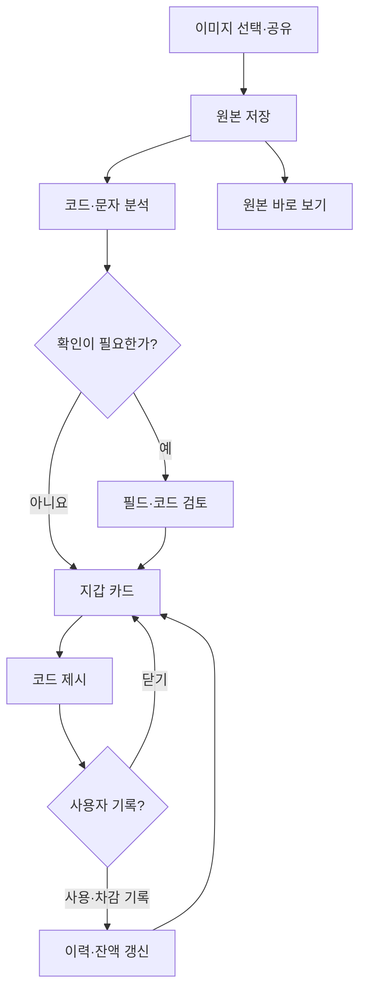

# 쿠폰잇 · CouponIt

## 자체 쿠폰 지갑 상세 기획 및 개발 계획 v2.0

> **제품 목표: 이미지를 넣으면 내 쿠폰으로 정리되고, 무엇이 남았는지 한눈에 보고, 매장에서 바로 꺼내 쓰는 개인용 쿠폰 지갑.**

| 항목 | 정의 |
| --- | --- |
| 버전 | v2.0 — 삼성월렛 등록 보조에서 자체 쿠폰 지갑으로 전환 |
| 사용자 | 본인 소유 Android 스마트폰에서 사용하는 개인 1명 |
| 기본 언어 | 한국어 |
| 핵심 입력 | 갤러리 쿠폰 이미지, 다른 앱에서 공유한 이미지 |
| 핵심 출력 | 정리된 쿠폰 카드, 크게 표시한 원본 바코드·QR 영역, 사용 기록 |
| 사용 감각 | 앱을 빠르게 열어 필요한 쿠폰을 한 번 눌러 제시 |
| 실행 구조 | 스마트폰 내부 저장·로컬 분석, 자체 서버·계정 불필요 |
| 현재 단계 | 기획 및 설계. 앱 구현·스캐너·매장 사용 검증 전 |
| 기존 문서 관계 | v1.0의 월렛 연동·접근성 자동화 로드맵을 대체한다. 유지 기능은 아래 전환표에 명시 |

**기획 범위 설명:** 여기서 ‘삼성페이처럼 사용’은 빠른 실행, 쿠폰 선택, 큰 코드 제시라는 사용 경험을 뜻한다. 실제 사용은 가맹점이 쿠폰의 바코드·번호를 처리하는 방식이며, NFC 카드 결제 기능을 만들겠다는 의미가 아니다. 앱이 발행사 사용 상태·잔액을 자동 조회하는 기능도 기본 전제에 포함하지 않는다.

이 문서의 화면·정렬·데이터 모델·수치·일정은 설계안이다. 공식 API의 존재와 실제 매장 쿠폰 사용 성공은 별도 근거로 구분한다. 기존 대화에서 논의한 삼성월렛 테스트 결과를 자체 지갑 검증 결과로 재사용하지 않는다.

## 목차

1. 방향 전환과 제품 판단
2. 사용자 목표와 핵심 원칙
3. 지원할 쿠폰과 사용 범위
4. 전체 사용 흐름
5. 한눈에 보이는 홈
6. 쿠폰 카드·검색·정렬
7. 바로 사용 화면
8. 사용 기록과 잔액
9. 이미지 추가와 자동 정리
10. 인식·검토·중복 정책
11. 쿠폰 상세·보관함·편집
12. 알림·빠른 실행·개인화
13. 전체 화면 명세와 문구
14. 코드 표시와 실사용 검증
15. 앱 구조와 데이터 흐름
16. 데이터 모델과 상태 규칙
17. 저장·백업·개인정보
18. 오류·중단·복구
19. 기능 우선순위와 MVP
20. 품질 목표와 측정
21. 테스트 계획
22. 단계별 개발 일정
23. 개발 작업 목록
24. 출시·운영·향후 확장
25. 초기 개발 지시와 인수 기준
26. 공식 근거와 미확인 항목

---

## 1. 방향 전환과 제품 판단

### 1.1 새 방향의 의미

앱이 쿠폰을 직접 저장하고 보여주면 핵심 사용자 흐름을 우리가 제어할 수 있다. 외부 월렛의 이미지 수신 방식이나 버튼 구조 변화에 맞추는 작업이 사라지고, 빠른 검색·원본 표시·사용 기록·백업을 제품 중심으로 설계할 수 있다.

다만 원본 이미지에 있는 코드가 읽히는 것, 매장 스캐너가 휴대폰 화면을 읽는 것, 발행사가 해당 쿠폰을 승인하는 것은 각각 다른 검증이다. 초기 개발에서는 이 세 단계를 구분한다.

### 1.2 기존 기획 전환표

| v1.0 요소 | v2.0 결정 | 새 역할 |
| --- | --- | --- |
| 삼성월렛 이미지 전달 | 제거 | 앱 내부 원본·코드 표시 |
| 접근성 서비스 | 제거 | 자체 화면 안에서 사용자가 직접 조작 |
| 외부 저장 버튼 자동 클릭 | 제거 | 로컬 쿠폰 저장 완료를 직접 확인 |
| 월렛 완료 증거·호환성 프로필 | 제거 | 코드 표시 검증·실사용 호환 기록 |
| 등록 대기열 | 변경 | 이미지 가져오기·분석 목록 |
| 저장 결과 미확인 | 변경 | 정보 확인 필요 / 사용 기록 미입력 |
| 이미지 사본·원본 보존 | 유지 | 오프라인 제시·재분석·백업 |
| 바코드·OCR 후보 | 중요도 상승 | 카드 자동 정리·사용할 코드 선택 |
| 중복 쿠폰 탐지 | 유지 | 같은 쿠폰의 중복 보관·사용 혼동 방지 |
| 기간·사용 상태 | 확대 | 홈 정렬·만료 알림·사용 기록 |
| 로컬 DB·복구 | 유지 | 지갑 데이터와 사용 이력 보호 |

### 1.3 핵심 제품 결정

**첫 버전부터 자체 보관과 코드 제시가 완결되어야 한다.** OCR이 일부 실패해도 원본을 볼 수 있어야 하고, 네트워크가 없어도 이미 가져온 쿠폰을 열 수 있어야 한다. 추후 자동 분류가 좋아지더라도 초기 쿠폰과 사용 이력이 유지되어야 한다.

### 1.4 가장 먼저 검증할 것

본인 소유 정적 쿠폰 한 장을 가져와 원본을 저장하고, 바코드 영역을 크게 보여준다. 다른 기기의 코드 리더로 payload가 같은지 확인한 뒤, 필요한 경우 실제 사용 의사가 있는 쿠폰을 매장에서 제시해 본다. 실제 사용 시험은 쿠폰을 소진할 수 있으므로 자동 반복하지 않는다.

## 2. 사용자 목표와 핵심 원칙

### 2.1 사용자가 답을 얻어야 할 질문

- 지금 어떤 쿠폰이 남아 있는가?
- 지금 들어간 매장에서 쓸 쿠폰이 있는가?
- 먼저 써야 할 쿠폰은 무엇인가?
- 어느 버튼을 누르면 직원에게 바로 보여줄 수 있는가?
- 이미 쓴 쿠폰인지, 금액이 얼마나 남았다고 기록했는가?

### 2.2 제품 원칙

| 원칙 | 구체적 구현 방향 |
| --- | --- |
| 한눈에 파악 | 사용처·상품명·기간·종류·사용 기록을 카드에서 구분 |
| 빠른 제시 | 홈 카드의 ‘바코드’ 버튼으로 바로 사용 화면 진입 |
| 자동 정리 | 이미지에서 코드·상품명·사용처·기간 후보 추출 |
| 불확실성 유지 | 읽지 못한 날짜·잔액·코드를 임의 확정하지 않음 |
| 원본 접근 | 어느 사용 화면에서든 원본을 다시 볼 수 있음 |
| 짧은 기록 | 교환권은 사용 처리, 금액권은 금액 기록을 쉽게 제공 |
| 되돌리기 | 사용 처리·잔액 수정·삭제의 실수 복구 |
| 로컬 우선 | 저장된 쿠폰을 보는 데 로그인·서버 응답 불필요 |

### 2.3 조작 목표

앱이 열려 있는 상태에서 홈에 보이는 쿠폰은 ‘바코드’ 한 번으로 제시 화면에 도달한다. 목록에 없는 쿠폰은 사용처 필터 또는 검색 후 제시한다. 앱 잠금 기능을 켠 경우 인증 단계는 추가될 수 있다. ‘언제나 한 번’처럼 조건을 숨기지 않는다.

### 2.4 이름과 정체성

쿠폰잇 / CouponIt 가칭을 유지한다. 정체성은 ‘내 쿠폰을 놓치지 않고 쓰게 해주는 지갑’이다. 화면에 삼성 로고·공식 제휴 표현을 넣지 않는다. 초기 안내 문구는 ‘쿠폰 이미지를 모아두고, 필요할 때 바로 꺼내 쓰세요.’로 한다.

## 3. 지원할 쿠폰과 사용 범위

### 3.1 쿠폰 유형

| 유형 | 예 | 기본 사용 경험 | 기록 방식 |
| --- | --- | --- | --- |
| 상품 교환권 | 음료 1잔, 상품 1개, 음식 세트 | 바코드 제시 후 사용 처리 | 사용 전 / 사용 기록 완료 |
| 금액권 | 1만원 모바일 상품권 | 바코드 제시 후 사용 금액 기록 | 사용 내역·사용자가 기록한 잔액 |
| 할인권 | 일정 금액·비율 할인 | 조건 확인 후 코드 제시 | 1회성 또는 사용 규칙 확인 |
| 번호 입력권 | 앱·웹에 번호 입력 | 번호 확인·복사와 원본 보기 | 사용자가 사용 여부 기록 |
| 종류 미확인 | 이미지로만 받은 자료 | 원본 보관·수동 분류 | 확인 필요 |

### 3.2 코드 유형과 조건

정적 바코드를 1차 대상으로 한다. QR은 ‘쿠폰 코드’, ‘상품 안내’, ‘웹 연결’, ‘시간에 따라 변하는 인증 코드’ 등을 구분해야 한다. QR을 해독했다는 이유만으로 매장 제시용 코드라고 판단하지 않는다. 동적 코드·계정 인증이 필요한 쿠폰은 발행사 화면을 여는 참고 자료로만 다루고, 저장한 스크린샷으로 정상 사용을 보장하지 않는다.

### 3.3 지원 수준 표시

| 앱에서 확보한 것 | 사용자 표시 | 가능한 행동 |
| --- | --- | --- |
| 원본만 저장 | 원본 저장됨 | 원본 확대·정보 수정 |
| 코드 영역 선택 및 해독 | 바코드 확인됨 | 해당 영역 크게 보기 |
| 정보 일부 불명확 | 기간 확인 필요 등 | 필요한 항목만 수정 |
| 외부 인증·동적 코드 의존 | 발행처에서 확인 | 명시적 외부 이동 또는 원본 안내 |

‘바코드 확인됨’은 해독 사실이다. 유효한 쿠폰, 잔액 보유, 사용 가능한 매장이라는 보증 배지로 사용하지 않는다.

### 3.4 초기 범위

사진 선택·공유 수신, JPEG·PNG, 한국어 상품 정보, 원본 기반 코드 표시를 기본으로 한다. 카메라 촬영·HEIC·긴 이미지·여러 쿠폰이 섞인 이미지·PDF는 단계적으로 확장한다. 원본의 이용 조건은 상세 화면에서 보존한다.

## 4. 전체 사용 흐름

### 4.1 최초 추가

1. 홈의 ‘쿠폰 추가’를 누른다.
2. 갤러리 이미지 여러 장을 선택한다.
3. 앱이 원본 사본을 먼저 저장한다.
4. 코드·상품명·사용처·기간을 분석한다.
5. 정보가 읽힌 쿠폰은 지갑에 정리하고, 애매한 항목만 검토 대상으로 표시한다.
6. 사용자는 필요한 쿠폰만 수정한다. 모든 쿠폰을 일일이 확인해야만 저장되는 구조로 만들지 않는다.

### 4.2 매장 앞에서 사용

1. 앱 실행 또는 홈 화면 바로가기.
2. 사용처로 찾거나 홈의 임박 쿠폰 선택.
3. ‘바코드’ 버튼으로 큰 코드 제시.
4. 실제 교환·차감 결과를 확인.
5. 교환권은 ‘사용했어요’, 금액권은 ‘사용 금액 기록’으로 정리.

### 4.3 사용하지 않고 닫음

바코드를 열었다가 닫아도 쿠폰은 사용 전으로 남는다. 매장 스캔 여부를 앱이 자동 감지했다고 표시하지 않는다. 아직 사용하지 않은 쿠폰을 미리 확인하는 상황에서 기록 질문을 매번 강제하지 않는다.

### 4.4 대량 추가 후 나중에 정리

가져온 원본이 안전하게 저장된 뒤 분석은 순차 처리한다. 홈의 ‘정보 확인 3개’는 분석 실패·필수 정보 후보를 보여준다. 이름·기간이 없어도 원본은 즉시 볼 수 있다. 분석 완료 순서가 바뀌어도 선택 순서와 자산 연결을 보존한다.

### 4.5 한눈에 보는 요약

기본 흐름은 **추가 → 자동 정리 → 홈에서 선택 → 코드 제시 → 짧은 사용 기록**이다. 숨겨진 외부 앱 조작이나 사용자가 보지 못하는 자동 사용 처리는 넣지 않는다.

## 5. 한눈에 보이는 홈

### 5.1 화면 구조

| 위치 | 구성 | 보여줄 정보 | 누르면 |
| --- | --- | --- | --- |
| 상단 | 쿠폰잇 제목·추가 | 쿠폰 추가 행동 | 사진 선택 |
| 요약 1줄 | 사용 전 N개 · 7일 안에 M개 | 사용자가 기록한 상태와 확인된 날짜 기반 | 해당 조건 필터 |
| 검색 | 사용처·상품명 검색 | 검색어 입력 | 목록 필터 |
| 사용처 필터 | 전체·보유 사용처 | 보유 쿠폰이 있는 브랜드만 | 해당 사용처 목록 |
| 목록 도구 | 만료 임박순·그리드/목록 | 현재 보기 조건 | 보기 변경 |
| 본문 | 쿠폰 카드 | 상품 이미지·사용처·상품명·기간·사용 유형 | 상세 또는 바코드 |
| 필요 시 | 정보 확인 N개 | 저장된 쿠폰의 미확인 필드 | 검토 목록 |
| 하단 | 지갑·보관함·설정 | 앱 주요 구역 | 화면 이동 |

### 5.2 첫 화면의 밀도

일반 글자 크기의 360~430dp 폭에서 카드 2열을 기본으로 검토한다. 실제 화면 높이에 따라 첫 화면에 4개 안팎의 카드를 보이게 하는 것을 목표로 한다. 큰 글자 모드·좁은 폭에서는 1열 목록으로 바꾼다. 어떤 글자 크기에서도 반드시 4개를 보여주겠다고 글씨를 줄이지 않는다.

처음부터 추천 캐러셀·사용 통계·큰 홍보 배너로 공간을 소비하지 않는다. 카드마다 대표 상품 영역을 넣어 같은 브랜드의 서로 다른 상품을 빠르게 구분한다. 바코드가 들어간 전체 쿠폰 스크린샷을 그대로 썸네일로 쓰지 않고 상품 영역 또는 중립적인 유형 아이콘을 사용한다.

### 5.3 요약 숫자 정의

| 지표 | 계산 규칙 |
| --- | --- |
| 사용 전 | 사용자가 사용 완료로 기록하지 않았고 보관 제외하지 않은 쿠폰 수. 기록과 실제 상태가 다를 수 있음 |
| 7일 안에 | 위 집합 중 사용자가 확인한 날짜가 오늘부터 7일 이내인 항목. 날짜 미확인은 제외하고 별도 안내 |
| 정보 확인 | 저장됐지만 날짜·코드·종류 등 검토가 남은 항목 수 |
| 기록 잔액 합계 | 같은 통화·금액권 중 잔액 기록이 있는 항목만, 부분 합계임을 표시. 초기 홈에서는 생략 권장 |

기본 홈에는 ‘총 자산 123,000원’ 같은 숫자를 넣지 않는다. 교환권 가격·할인권 가치·미확인 잔액을 합치면 쓸 수 있는 돈처럼 오해하기 쉽다. 필요한 경우 금액권 필터 안에서 ‘기록한 잔액 합계’를 제공한다.

### 5.4 임박 쿠폰을 보여주는 방식

별도의 큰 섹션에 반복 배치하지 않고 기본 목록을 임박순으로 정렬한다. 상단 요약에서 임박 항목만 좁혀 볼 수 있다. 날짜가 확정되지 않은 항목에는 추정 D-day를 붙이지 않고 ‘기간 확인’ 배지를 표시한다.

### 5.5 사용처별 보기

보유한 쿠폰의 사용처를 기반으로 필터를 만든다. 순서는 즐겨찾는 사용처 → 보유 개수 → 이름의 초기안으로 둔다. 브랜드를 모르면 ‘사용처 미확인’에 둔다. 발행사 이름과 실제 사용할 매장 이름을 별도 필드로 유지한다.

사용처 필터와 ‘카페·편의점·음식’ 같은 분류 필터를 동시에 복잡하게 노출하지 않는다. 기본은 사용처 필터, 분류는 추가 필터로 둔다. 전체에서 보던 정렬은 사용처를 바꿔도 유지한다.

### 5.6 빈 상태

| 상황 | 문구 | 대표 행동 |
| --- | --- | --- |
| 처음 사용 | 쿠폰 이미지를 추가해 보세요. | 쿠폰 추가 |
| 검색 결과 없음 | 찾는 쿠폰이 없어요. | 검색어 지우기 |
| 전부 사용 기록됨 | 사용 전으로 남겨둔 쿠폰이 없어요. | 보관함 보기 |
| 날짜 정보 부족 | 기간을 확인하면 먼저 쓸 쿠폰을 정리해 드려요. | 기간 확인 |
| 분석 중 | 쿠폰 정보를 정리하고 있어요. 원본은 바로 볼 수 있어요. | 원본 보기 |

## 6. 쿠폰 카드·검색·정렬

### 6.1 카드에 항상 보일 것

사용처, 상품명 최대 2줄, 대표 이미지 또는 유형 아이콘, 만료 정보, 사용 유형, ‘바코드’ 또는 ‘원본’ 버튼을 기본으로 한다. 금액권에 기록 잔액이 있으면 가격 대신 ‘기록 잔액 6,500원’을 보여준다. 잔액이 없으면 ‘1만원권 · 잔액 미기록’처럼 구분한다.

### 6.2 카드 배지

| 조건 | 배지 |
| --- | --- |
| 날짜가 오늘 | 오늘까지 |
| 확인된 날짜가 가까움 | D-3 등 |
| 날짜 후보만 있음 | 기간 확인 |
| 코드 후보 여러 개 | 코드 선택 |
| 사용 금액 일부 기록 | 일부 사용 기록 |
| 외부 화면이 필요함 | 발행처 확인 |

색상 외에 문구를 함께 사용한다. ‘오늘까지’는 원문 날짜 기준이며 영업 종료·발행처 조건까지 보장하는 표현으로 확장하지 않는다.

### 6.3 터치 계약

- 카드 본문: 쿠폰 상세.
- 카드의 ‘바코드’: 바로 사용 화면.
- 즐겨찾기: 선택 상태 토글. 사용 처리와 혼동하지 않게 분리.
- 길게 누르기: 다중 선택 모드.
- 목록 좌우 스와이프: v2.0 기본에서는 사용 완료·삭제에 연결하지 않음.

### 6.4 기본 정렬 규칙

1. 기본 지갑에는 사용 전·일부 사용 기록 쿠폰을 표시한다.
2. 확인된 유효기간이 가까운 항목부터 보여준다.
3. 날짜가 같으면 최근 추가순으로 안정적으로 정렬한다.
4. 기간 미확인 항목은 지정된 끝 그룹에 두되 요약에 확인 개수를 표시한다.
5. 기록상 사용 완료·제외 항목은 보관함으로 보낸다.
6. 기한 경과 항목은 날짜 상태로 보관함에서 찾되 원본 삭제나 사용 완료 처리는 하지 않는다.

즐겨찾기는 별도 필터로 제공한다. 기본 임박순 위에 즐겨찾기를 강제 배치해 만료 임박 쿠폰을 밀어내지 않는다.

### 6.5 검색 범위

사용처·상품명·사용자 메모·태그를 기본 검색 대상으로 한다. 전체 쿠폰 번호는 기본 검색 후보·최근 검색어에 노출하지 않는다. 필요 시 상세에서 번호 확인·복사를 제공한다. 초기 개인 보관량에서는 단순 로컬 검색으로 시작하고 1,000건 수준에서 지연이 나타나는지 측정한다.

### 6.6 동일 상품 여러 장

같은 상품 이미지라도 서로 다른 쿠폰 번호면 별도 카드로 보관한다. ‘이 상품 3개’로 묶는 기능은 후속이다. 묶더라도 각 코드와 유효기간이 독립적이며, 첫 번째 쿠폰을 사용한 뒤 다음 쿠폰으로 넘어가는 동작은 명시적으로 제공해야 한다.

## 7. 바로 사용 화면

### 7.1 화면 구성

상단은 닫기·사용처, 그 아래 상품명·기간, 중앙은 흰 배경의 큰 코드 영역, 하단은 번호 보기·원본 보기·사용 기록 버튼으로 구성한다. 여러 코드를 한 번에 띄우지 않는다. 1차원 바코드는 넓은 가로 폭을 확보하고, QR은 정사각형 영역으로 표시한다.

| 요소 | 동작 |
| --- | --- |
| 코드 영역 | 선택한 원본 코드 영역을 종횡비 유지해 표시 |
| 밝게 보기 | 현재 화면의 밝기만 높임 |
| 원본 보기 | 상품명·코드·이용 조건이 포함된 원본 전체로 전환 |
| 번호 보기·복사 | 원본 코드와 연결된 번호를 명시적으로 표시·복사 |
| 방향 전환 | 긴 코드에 필요하면 가로 보기 제공 |
| 사용했어요 | 교환권 사용 기록, 즉시 되돌리기 제공 |
| 사용 금액 기록 | 금액권 입력 화면 |
| 닫기 | 사용 전 상태 유지, 밝기·화면 유지 설정 원복 |

### 7.2 밝기·화면 꺼짐

코드 제시 중에는 현재 앱 창의 밝기를 조정하고 화면이 유지되도록 설계한다. 사용자가 끌 수 있는 옵션을 제공한다. 화면을 벗어나거나 앱이 백그라운드로 가면 밝기 override와 화면 유지 요청을 해제한다. 기기의 전역 밝기 설정을 변경하는 권한을 기본 요구하지 않는다. Android는 창별 `screenBrightness`와 화면 유지 플래그를 제공한다. [WindowManager.LayoutParams](https://developer.android.com/reference/android/view/WindowManager.LayoutParams)

### 7.3 스캔 방해 요소 제거

바코드 위에 버튼·텍스트·배지·진행 애니메이션을 겹치지 않는다. 반전 효과·반투명 필터·장식 그림자를 코드에 적용하지 않는다. 원본의 코드 주변 여백이 잘리지 않게 하고, 다른 쿠폰 코드가 화면에 같이 나타나지 않게 한다.

### 7.4 앞뒤 쿠폰 이동

사용처 필터에서 진입했다면 같은 사용처의 쿠폰 집합 안에서만 ‘이전/다음’을 후속 제공할 수 있다. 이동할 때 상품명·이미지·기간·코드가 함께 바뀌어야 한다. 사용 처리 없이 자동으로 다음 쿠폰을 띄우지 않는다. v2.0 MVP는 한 번에 하나 제시하고 홈으로 돌아오는 단순 흐름을 우선한다.

### 7.5 삼성페이처럼 빠르게 여는 범위

기본은 앱 아이콘, 홈 화면 바로가기, 선택적 위젯이다. 어느 앱에서나 아래에서 쓸어 올리기, 잠금 화면을 건너뛰기, 시스템 결제 제스처 가로채기는 제품 요건으로 잡지 않는다. Android 바로가기는 앱 기능으로 빠르게 진입하는 수단으로 사용한다. [Android 바로가기 문서](https://developer.android.com/develop/ui/compose/system/shortcuts/creating-shortcuts)

### 7.6 실패 시 대안

크롭 코드가 안 읽히면 원본을 연다. 원본도 안 읽히면 실제 쿠폰 번호를 확인하거나 발행처의 정상 사용 경로를 확인한다. 앱이 숫자를 새로 만들거나 코드를 임의 수정해 성공시키려 하지 않는다.

## 8. 사용 기록과 잔액

### 8.1 자동으로 할 수 있는 것과 사용자 확인이 필요한 것

이미지 정리·코드 선택 보조·날짜 후보·정렬·알림은 자동화할 수 있다. 매장 스캐너가 코드를 읽었다는 사실, 발행사 승인 여부, 실제 잔액은 로컬 앱만으로 확정하지 않는다. 따라서 사용 상태는 명시적으로 ‘사용자 기록’으로 관리한다.

### 8.2 교환권

‘사용했어요’를 누르면 사용 일시를 남기고 보관함으로 이동한다. 기본 입력은 버튼 하나이며 매장·메모는 선택이다. 완료 안내에 ‘되돌리기’를 제공하고 보관함에서도 수정할 수 있다. 바코드를 열거나 밝기를 켰다는 이유로 자동 사용 처리하지 않는다.

### 8.3 금액권

| 단계 | 행동 |
| --- | --- |
| 처음 저장 | 액면가 후보 표시. 사용 이력이 없다고 확정하지 않음 |
| 잔액 미기록 | ‘현재 잔액 입력’ 또는 ‘사용 금액 기록’ 제공 |
| 현재 잔액 확인 | 사용자가 영수증·발행처 화면 등을 보고 기준 잔액 입력 |
| 사용 후 | 기준 잔액이 있으면 사용 금액 차감 결과 제안 |
| 차이 발견 | ‘실제 확인한 잔액으로 수정’하여 정정 이력 기록 |
| 0원 기록 | 기록상 소진으로 표시, 원본과 이력 보존 |

예를 들어 10,000원권이라도 이미 일부 사용했을 수 있으므로 저장 즉시 잔액 10,000원으로 확정하지 않는다. 초기 잔액이 없으면 사용 금액만 기록하고 잔액은 미확인으로 둔다. 기준 잔액 10,000원에서 3,500원 사용을 기록한 경우에만 ‘기록 잔액 6,500원’을 계산한다.

### 8.4 잔액 정정·되돌리기

기록은 거래·정정 이벤트로 보존한다. 사용 기록 취소는 원래 기록을 삭제해 흔적을 없애기보다 취소 이벤트 또는 수정 버전으로 반영한다. 중복 탭은 같은 요청 ID로 한 번만 처리한다. 기준 잔액이 사용 금액보다 작으면 음수 잔액을 자동 확정하지 않고 입력을 점검한다.

### 8.5 할인권·다회 사용권

유효기간 내 여러 번 사용할 수 있는 할인권은 한 번 사용했다고 완료로 이동시키지 않는다. 사용 규칙을 사용자 선택 필드로 두고, 횟수 제한이 불명확하면 사용 로그만 남긴다. 초기 MVP는 상품 교환권·금액권부터 완성하고 복잡한 다회 사용권은 원본 보관으로 지원한다.

### 8.6 사용 기록을 잊은 경우

앱은 ‘최근 제시’와 ‘사용 완료’를 분리한다. 설정에 따라 최근 제시한 쿠폰에서 기록 선택을 다시 보여줄 수 있으나, 스캔 성공을 감지했다고 표현하지 않는다. 미리 보기만 한 경우에는 ‘아직 안 썼어요’ 또는 닫기로 상태를 유지한다.

## 9. 이미지 추가와 자동 정리

### 9.1 입력 방법

시스템 Photo Picker로 여러 장을 선택하거나, 메신저·갤러리에서 공유할 때 쿠폰잇을 선택한다. 사용자가 고르지 않은 갤러리 전체를 기본으로 스캔하지 않는다. 사진 접근은 선택 파일 중심으로 구성한다. [Android Photo Picker](https://developer.android.com/training/data-storage/shared/photo-picker)

### 9.2 가져오기 순서

URI 확인 → 스트리밍 사본 저장 → 파일 검증·해시 → 원본 확정 → 썸네일 생성 → 코드 분석 → 문자 후보 분석 → 자동 정리 → 필요한 항목만 검토.

원본 저장 성공과 정보 분석 성공을 구분한다. 원본이 저장되면 분석 완료 전에도 열 수 있다. 임시 파일을 먼저 쓰고 완료된 파일만 DB에 연결하며, 중단 시 미완성 자산을 정리한다.

### 9.3 초기 한도

한 번에 30장, 파일당 20 MiB, 최대 40메가픽셀을 초기 앱 한도로 제안한다. 기기·선택기 한도가 낮으면 그 한도를 따른다. 이미지 전체를 한 번에 메모리에 올리지 않고, 원본·코드 분석 영역·썸네일을 목적별로 디코딩한다. 수치는 실측 후 수정한다.

### 9.4 자동 정리 결과

| 결과 | 처리 |
| --- | --- |
| 코드와 기본 정보가 읽힘 | 지갑 카드 생성, 자동 추출 출처 저장 |
| 코드만 읽힘 | 이미지·코드로 보관, 이름·기간 확인 표시 |
| 상품명만 읽힘 | 원본 보관, 코드 선택 또는 원본 제시 |
| 여러 코드 | 후보 영역 표시, 사용 코드 선택 요청 |
| 비쿠폰 가능성 | ‘쿠폰인지 확인’ 목록, 자동 삭제 안 함 |
| 같은 이미지 | 기존 항목 보여주고 중복 추가 선택 |

### 9.5 홈에 반영되는 시점

이미지가 안전하게 저장된 뒤 카드가 나타난다. 분석 중에는 ‘정보 정리 중’을 보조 문구로 표시한다. 이름·기간이 갱신돼도 사용자가 현재 제시 중인 화면의 코드가 다른 후보로 바뀌면 안 된다. 제시 세션은 선택 당시 코드·원본 버전을 고정한다.

## 10. 인식·검토·중복 정책

### 10.1 로컬 인식 구성

ML Kit의 번들 바코드 모델과 한국어·라틴 OCR을 후보로 사용한다. 최초 실행부터 오프라인 분석을 목표로 하므로 모델 포함 여부를 빌드에서 확인한다. 무거운 범용 LLM은 초기 필수 구성으로 두지 않는다. [바코드 인식](https://developers.google.com/ml-kit/vision/barcode-scanning/android), [텍스트 인식](https://developers.google.com/ml-kit/vision/text-recognition/v2/android)

### 10.2 추출할 데이터

| 필드 | 자동 추출 | 사용자 검토 |
| --- | --- | --- |
| 사용처 | 텍스트·로컬 별칭 사전 | 발행사와 혼동 시 수정 |
| 상품명 | 대표 문구 후보 | 원문 비교 |
| 만료일 | ‘유효기간’ 주변 날짜 | 발행일·구매일·복수 날짜 구분 |
| 쿠폰 종류 | 교환권·금액권·할인권 후보 | 애매하면 미확인 |
| 액면가 | 금액 문구 | 잔액으로 자동 사용하지 않음 |
| 코드 | 바코드 해독 결과·원본 영역 | 복수 코드·OCR 불일치 확인 |
| 이용 조건 | OCR 원문 및 원본 | 자동 요약만으로 조건 대체하지 않음 |

### 10.3 코드 보존

쿠폰 번호는 문자열과 필요 시 원본 bytes로 저장하고 선행 0·대소문자·구분 기호를 보존한다. 바코드 형식도 함께 저장한다. QR URL을 자동 방문하지 않는다. OCR 숫자와 바코드가 다르면 자동 교정하지 않는다.

### 10.4 날짜 확정

날짜만 있으면 날짜로 보관하고 사용 마감 시각을 임의 생성하지 않는다. 연도가 없거나 복수 후보면 사용자가 확인한다. D-day와 알림은 확인된 날짜 기준이며, 영업 시간·사용 제한은 원본에서 확인할 수 있게 한다. OCR이 확정한 날짜를 무조건 신뢰하는 구조는 피한다. 초기에는 자동 추출 날짜를 ‘확인 전’으로 저장하고 사용자가 한 번 확정하면 알림에 반영한다.

### 10.5 중복 계층

| 비교 | 동작 |
| --- | --- |
| 동일 bytes 해시 | 같은 이미지 후보 |
| 코드 형식·payload·사용처 문맥 일치 | 같은 쿠폰 후보 |
| 비슷한 이미지 | 검토 후보만, 자동 병합 금지 |
| 같은 상품명·가격·기간 | 단독 중복 판단 금지 |

상품 안내 QR은 여러 쿠폰에서 같을 수 있다. 동일 payload라도 그것이 실제 쿠폰 식별 코드인지 확인하지 않았다면 자동 병합하지 않는다. 병합 시 사용 기록·원본 여러 장을 보존하고 사용자의 선택을 받는다.

### 10.6 사용자 수정값

사용자가 확정한 상품명·날짜·종류·잔액은 재분석 결과가 덮어쓰지 않는다. 새 분석값은 후보로 보여준다. 모델·규칙 버전을 저장해 잘못 분류한 이유를 확인할 수 있게 한다.

## 11. 쿠폰 상세·보관함·편집

### 11.1 상세 화면

상품 이미지·이름·사용처·기간·종류·바코드 버튼을 먼저 배치한다. 아래에 원본 이미지, 이용 조건, 메모·태그, 사용 기록, 정보 수정, 보관·삭제를 둔다. 기술 진단 수치와 OCR 원문 전체를 기본 화면에 펼치지 않는다.

### 11.2 보관함

보관함은 ‘사용 기록 완료’, ‘기한 경과’, ‘직접 보관’, ‘휴지통’ 필터로 구성한다. 사용 여부와 날짜 경과는 독립적이므로 필터 간 중복이 있을 수 있고 각 개수를 합산한 총합처럼 표시하지 않는다. 기한 경과가 발행사 취소·환불·권리 소멸 확정을 의미하지 않게 한다.

### 11.3 편집

상품명·사용처·기간·종류·메모를 수정할 수 있다. 액면가·기준 잔액·사용 기록은 서로 다른 편집 화면으로 분리한다. 이미지 재분석은 선택적으로 실행하며 원본을 교체하려면 새 자산과 이전 자산의 관계를 기록한다.

### 11.4 삭제

일반 삭제는 휴지통으로 이동하고 복원 기회를 제공한다. 초기 보관 기간은 30일 제안이며 설정에서 안내한다. 영구 삭제에는 재확인을 둔다. 휴지통에 있는 쿠폰은 기본 지갑·알림·잔액 합계에서 제외한다. 원래 갤러리 사진은 삭제하지 않는다.

## 12. 알림·빠른 실행·개인화

### 12.1 만료 알림

기본 제안은 D-7·D-1·당일 오전의 묶음 알림이다. 사용자가 확인한 날짜와 사용 기록을 기준으로 하며, 사용 완료·삭제·직접 제외 쿠폰은 알림 대상에서 뺀다. 한 날 여러 쿠폰이 있으면 하나로 묶어 해당 목록을 연다.

정확한 초 단위 알람을 보장할 필요는 없다. OS 예약 작업이 지연될 수 있으므로 앱을 열 때도 날짜 상태를 갱신한다. 알림 권한을 거절해도 홈의 임박 표시와 쿠폰 제시는 동작해야 한다. [Android 알림 권한](https://developer.android.com/develop/ui/views/notifications/notification-permission)

### 12.2 빠른 실행

앱 바로가기는 ‘내 지갑’, ‘쿠폰 추가’, ‘즐겨찾기’를 후보로 한다. 기기에서 지원되는 바로가기 기능을 활용하고, 삭제된 쿠폰 링크는 오류 대신 지갑으로 안전하게 이동시킨다. 개별 쿠폰 바로가기는 후속 기능이다.

### 12.3 홈 화면 위젯

후속 위젯은 ‘임박 쿠폰 2~3개’ 또는 ‘즐겨찾는 사용처’로 한정한다. 바코드 자체를 위젯·잠금 화면에 표시하지 않는다. 눌렀을 때 앱의 현재 상태를 조회해 사용 완료·삭제·만료 정보가 최신인지 확인한다.

### 12.4 개인화

기본 보기(2열/목록), 즐겨찾는 사용처, 밝게 보기, 화면 유지, 알림 시점, 앱 잠금, 최근 제시 기록, 휴지통 보관 기간을 설정한다. 초기에는 기능별 세부 스위치를 과도하게 노출하지 않는다.

## 13. 전체 화면 명세와 문구

| ID | 화면 | 핵심 정보 | 주 행동 | 오류·빈 상태 |
| --- | --- | --- | --- | --- |
| UI-01 | 시작 안내 | 앱 목적·로컬 보관 | 쿠폰 추가 | 권한 거절 시 안내 |
| UI-02 | 지갑 홈 | 요약·검색·사용처·카드 | 바코드 / 쿠폰 추가 | 쿠폰 없음·검색 없음 |
| UI-03 | 가져오기 결과 | 저장·분석·중복 후보 | 지갑으로 / 확인 | 읽기 실패만 별도 |
| UI-04 | 정보 검토 | 원본·코드·기간 후보 | 저장 | 필드별 미확인 |
| UI-05 | 쿠폰 상세 | 상품·기간·원본·이력 | 바코드 | 원본 손상 복구 |
| UI-06 | 바로 사용 | 큰 코드·원본·사용 기록 | 사용했어요 / 금액 기록 | 코드 미확인·원본 전환 |
| UI-07 | 금액 기록 | 기준 잔액·사용 금액 | 기록 저장 | 기준 없음·음수 검토 |
| UI-08 | 보관함 | 사용 기록·기한 경과·휴지통 | 복원 / 상세 | 해당 항목 없음 |
| UI-09 | 설정 | 보기·알림·잠금·백업 | 설정 변경 | 권한·백업 오류 |
| UI-10 | 백업·복원 | 마지막 백업·파일·복원 미리보기 | 백업 / 복원 | 암호 오류·손상·충돌 |

### 13.1 대표 한국어 문구

| 상황 | 문구 |
| --- | --- |
| 분석 완료 | 쿠폰 8개를 정리했어요. 2개는 기간 확인이 필요해요. |
| 원본만 확보 | 원본은 저장했어요. 쿠폰 정보를 확인해 주세요. |
| 동일 코드 후보 | 같은 쿠폰으로 보이는 항목이 있어요. |
| 사용 처리 | 사용한 쿠폰으로 기록했어요. |
| 금액 기록 | 기록 잔액을 6,500원으로 업데이트했어요. |
| 미확인 잔액 | 현재 잔액을 입력하면 사용 내역을 계산할 수 있어요. |
| 제시 화면 | 직원에게 바코드를 보여주세요. |
| 화면 닫기 | 별도 사용 처리 없이 닫음 |
| 기한 경과 | 이미지에 표시된 기간이 지났어요. |
| 백업 없음 | 앱을 삭제하면 쿠폰과 기록을 잃을 수 있어요. |

### 13.2 접근성과 반응형 기준

큰 글자에서 카드가 1열로 바뀌어도 정보가 잘리지 않게 한다. 색만으로 상태를 표시하지 않는다. 코드 이미지에는 ‘현재 쿠폰 바코드’ 같은 접근성 라벨을 주고 번호는 사용자가 선택할 때 읽도록 한다. 삭제·사용 완료의 터치 영역이 바코드 버튼과 겹치지 않게 한다.

## 14. 코드 표시와 실사용 검증

### 14.1 기본 표시 방식

v2.0 기본은 **원본 이미지의 선택된 코드 영역 표시**다. 해독값으로 새 바코드를 만드는 기능은 후속 실험으로 분리한다. 원본에서 이미 코드가 손상되어 있으면 단순 확대가 정보를 복원하지 못한다.

자동 검출 bounding box는 실제 스캔에 필요한 주변 여백을 충분히 포함하지 않을 수 있다. 원본에서 코드 주변 여백을 보존한 영역을 만들고, 작은 화면에서 잘리지 않게 종횡비를 유지한다. OCR 분석에 사용한 과도한 대비 조정 이미지를 매장 제시용 원본으로 대체하지 않는다.

### 14.2 표시 정책

| 정책 | 이유 |
| --- | --- |
| 코드와 배경을 명확히 구분 | 화면 스캔 시 대비 확보 |
| 원본 비율 유지 | 바코드 폭·간격 변형 방지 |
| 코드 주변 여백 유지 | 영역 검출·스캔 방해 방지 |
| 제시 중 한 코드만 표시 | 직원이 다른 코드를 스캔하는 혼동 감소 |
| 원본 전체 보기 유지 | 상품·사용 조건·코드를 함께 확인 가능 |
| 화면 밝기는 사용자 제어 | 주변 환경·기기 상태에 맞게 사용 |
| 번호 원문 보존 | 선행 0·제어 문자·인코딩 정보 손실 방지 |

ML Kit 문서는 입력 코드의 해상도·초점·형식이 해독에 영향을 준다고 설명한다. 이것은 인식 라이브러리의 입력 조건이며 매장 POS 지원 보증은 아니다. [ML Kit 바코드 가이드](https://developers.google.com/ml-kit/vision/barcode-scanning/android)

### 14.3 바코드 재생성은 후속 기능

원본 코드가 작거나 표시 품질이 낮을 때 재생성을 검토할 수 있다. 그러나 형식·payload뿐 아니라 FNC1·GS1 문맥·인코딩·제어 문자 등 의미가 유지되는지 확인해야 한다. 초기에는 지원 형식을 좁히고 재생성 코드 재해독 결과를 원본과 비교한 뒤 별도 실사용 시험을 거친다. 미지원 형식을 비슷한 바코드로 바꿔 표시하지 않는다.

### 14.4 3단계 검증

| 단계 | 절차 | 입증하는 것 | 입증하지 못하는 것 |
| --- | --- | --- | --- |
| V1 · 파일 분석 | 원본과 표시 영역을 해독 | 선택한 코드와 값의 일치 | 휴대폰 화면·POS 호환성 |
| V2 · 화면 해독 | 다른 기기 리더로 앱 화면 해독 | 화면에서 같은 payload가 읽힘 | 매장 승인·쿠폰 유효성 |
| V3 · 실사용 | 사용 의사가 있는 본인 쿠폰을 실제 매장에서 제시 | 해당 쿠폰·기기·매장 조건에서의 사용 결과 | 다른 모든 매장·쿠폰에 대한 보장 |

### 14.5 초기 시험 집합

| 집합 | 내용 |
| --- | --- |
| 정상 이미지 | 서로 다른 사용처의 정적 쿠폰, JPEG·PNG |
| 화질 예외 | 저해상도, 회전, 긴 스크린샷, 잘린 코드 |
| 복수 코드 | 안내 QR과 쿠폰 바코드, 쿠폰 여러 개 |
| 번호 예외 | 선행 0, 긴 숫자, 영문 혼합 |
| 사용 기록 | 교환권, 금액권 잔액 미기록, 부분 사용 |

V1/V2는 합성 코드로 충분한 회귀 시험을 수행할 수 있다. V3는 정상 본인 쿠폰과 실제 사용 결과를 기록한다. 합성 코드를 매장에 반복 제시해 유효한 쿠폰처럼 시험하지 않는다.

### 14.6 실사용 판정 기록

기기·OS·앱 버전·코드 종류·원본 해상도·밝기 조건·제시 방식·스캐너 해독 여부·발행사 승인 여부·사용자 기록을 분리한다. 스캐너가 못 읽은 것과 쿠폰이 이미 사용되었거나 조건에 맞지 않은 것은 별도 실패 원인이다.

## 15. 앱 구조와 데이터 흐름

### 15.1 기술 구성

| 영역 | 선택 | 책임 |
| --- | --- | --- |
| 플랫폼 | Kotlin 네이티브 Android | 이미지 입력·로컬 저장·창 제어 |
| UI | Jetpack Compose | 지갑·카드·상세·사용 화면 |
| 비동기 | Coroutines·Flow | 분석 진행·DB 변경 관찰 |
| DB | Room | 쿠폰·사용 이력·자산 참조 |
| 이미지 입력 | Photo Picker·공유 Intent | 사용자가 선택한 이미지 접근 |
| 코드 분석 | ML Kit Barcode Scanning | 코드 후보·원본 영역·payload |
| 문자 분석 | ML Kit 한국어·라틴 OCR | 상품·기간·사용처 후보 |
| 지연 작업 | WorkManager | 중단 가능한 분석·캐시 정리·알림 일정 |
| 설정 | DataStore 후보 | 보기·알림·밝기·잠금 설정 |
| 빠른 진입 | 앱 바로가기·후속 위젯 | 지갑·추가·즐겨찾기 이동 |

Room은 SQLite 기반 로컬 저장 추상화다. WorkManager는 지연 가능한 지속 작업용이며 분석이 즉시 계속되거나 알림이 정확한 시각에 도착함을 보장하는 용도로 쓰지 않는다. [Room](https://developer.android.com/training/data-storage/room), [지속 작업](https://developer.android.com/develop/background-work/background-tasks/persistent)

### 15.2 모듈 경계

| 모듈 | 책임 |
| --- | --- |
| Import | URI·사본 저장·입력 한도·실패 분리 |
| Recognition | 코드·문자 후보 분석 |
| CouponRepository | 쿠폰·확정값·원본 참조 |
| WalletViewModel | 홈 필터·정렬·요약·선택 |
| Presentation | 원본·코드 표시·밝기·제시 세션 |
| UsageLedger | 사용 기록·잔액 기준·정정·되돌리기 |
| Reminder | 날짜 기반 알림·중복 방지 |
| Backup | 내보내기·검증·복원·충돌 처리 |
| Diagnostics | 마스킹 오류·성능 지표 |

초기에는 단일 app 모듈 안의 패키지 경계로 충분하다. 개인용 소규모 앱을 위해 서버·마이크로서비스·다중 프로세스를 추가하지 않는다.

### 15.3 데이터 흐름

### 15.4 분석 작업의 복구

원본을 저장한 뒤 분석 작업을 등록한다. 앱이 종료되면 미완료 이미지 ID를 기준으로 재개한다. 반복 작업이 같은 후보·카드를 중복 생성하지 않도록 분석 실행 버전과 자산 ID로 구분한다. 사용자 수정값은 재분석이 변경하지 않는다.

### 15.5 라이브러리·SDK 정책

개인 기기의 실제 Android 버전을 기준으로 지원 하한을 확정한다. 기본 제안은 Android 11 이상이다. SDK·Kotlin·Compose·Room·모델 버전은 구현 시 공식 호환성을 확인해 잠근다. 현재 문서에 최신 버전 번호를 추측해 넣지 않는다.

## 16. 데이터 모델과 상태 규칙

### 16.1 엔티티

| 엔티티 | 주요 필드 | 비고 |
| --- | --- | --- |
| Coupon | id, title, merchantId, issuerName, type, faceValueMinor, currency, expiryDate, expiryConfirmed, favorite, archivedAt, deletedAt | 잔액은 액면가와 분리 |
| Merchant | id, displayName, aliases, category | 발행사와 구분 |
| ImageAsset | id, couponId, kind, path, sha256, mime, width, height, bytes | 원본·썸네일·파생 영역 |
| CodeCandidate | id, couponId, format, rawValue, rawBytes, bounds, selected, confirmed | 코드 형식·payload 보존 |
| FieldCandidate | id, couponId, field, value, rawText, source, selected | OCR·사용자 출처 |
| UsageEvent | id, couponId, type, amountMinor, currency, occurredAt, reversesEventId, operationId | 사용·잔액 기준·정정·취소 |
| PresentationSession | id, couponId, assetId, codeCandidateId, startedAt, endedAt | 제시와 실제 사용을 분리 |
| ImportJob | id, assetId, state, modelVersion, errorCode | 분석 복구 |
| ReminderRecord | id, couponId, dateKey, rule, deliveredAt | 같은 조건의 중복 알림 방지 |
| BackupManifest | schemaVersion, appVersion, createdAt, itemCounts, assetHashes | 복원 정합성 검사 |

### 16.2 상태 축

| 축 | 예 |
| --- | --- |
| 저장·분석 | 저장 중 / 원본 저장 / 분석 중 / 확인 필요 / 정리됨 / 실패 |
| 사용자 사용 기록 | 사용 전 / 일부 사용 기록 / 사용 완료 기록 |
| 날짜 | 미확인 / 표시 기간 내 / 표시 기간 경과 |
| 보관 | 지갑 / 직접 보관 / 휴지통 |
| 표시 | 원본만 / 선택 코드 있음 / 외부 확인 필요 |

단일 `isUsed` 값에 모든 상태를 합치지 않는다. 금액권 일부 사용, 날짜 경과, 원본 미분석이 동시에 존재할 수 있다.

### 16.3 사용 기록 이벤트

| 이벤트 | 의미 |
| --- | --- |
| REDEEM_MARKED | 교환권을 사용했다고 사용자 기록 |
| SPEND_RECORDED | 금액권 사용 금액 기록 |
| BALANCE_SET | 확인한 잔액을 새 기준으로 기록 |
| EVENT_REVERSED | 이전 사용·차감 기록 취소 |
| NOTE_ADDED | 사용과 무관한 메모 |

잔액 계산은 최신 유효 기준 잔액 이후의 유효 차감 기록을 적용한다. 기준보다 이전 시각의 내역을 나중에 입력하면 결과가 달라질 수 있으므로 정렬·적용 범위를 재계산하고 사용자에게 변경 결과를 보여준다. 임의로 과거 이력을 새 기준 뒤에 차감하지 않는다.

### 16.4 수치·시간 규칙

금액은 통화와 정수 최소 단위로 저장하고 부동소수점을 사용하지 않는다. 날짜만 있으면 LocalDate로, 사용 시각은 UTC instant로 보관한다. 목록 표시는 기본 한국 시간대에 맞추고 날짜 비교 기준을 설정에 명시한다. 코드값은 숫자형으로 변환하지 않는다.

### 16.5 정합성 규칙

사용 기록 저장과 상태·잔액 갱신은 같은 DB 트랜잭션으로 묶는다. operationId는 중복 버튼 요청을 방지한다. UI는 저장 성공을 받은 뒤 완료 상태를 보여준다. 파일 저장과 DB 저장은 별개이므로 임시 파일·고아 자산 복구가 필요하다.

## 17. 저장·백업·개인정보

### 17.1 로컬 저장

원본 사본은 앱 전용 저장소에, 구조화 정보는 Room에 보관한다. 썸네일·코드 표시 캐시는 재생성 가능하게 한다. 원래 갤러리 이미지를 삭제해도 가져온 사본을 열 수 있어야 한다. 앱 전용 저장소와 Room을 쓴다고 별도 DB 암호화가 완료되는 것은 아니다.

### 17.2 자체 지갑에서 백업의 중요성

다른 월렛에 복사해 둔다는 전제가 없어졌으므로 백업은 개인 실사용 버전의 필수 완료 항목이다. 개발 초기 APK는 제한된 테스트 자료로 사용하고, 장기 보관할 쿠폰을 맡기는 릴리스 전에 원본·사용 기록·잔액 기준을 복원할 수 있어야 한다.

### 17.3 백업 형식 요구사항

암호화된 단일 백업 파일에 버전 있는 manifest, 구조화 데이터, 원본 이미지, 자산 해시를 포함한다. 내보내기에는 검증된 암호화 라이브러리·포맷을 채택하고 자체 암호 알고리즘을 만들지 않는다. 구현 단계에서 Android 호환성과 다른 기기 복원 가능성을 검증해 구체 포맷을 확정한다.

기기 안에만 있는 키로 암호화하고 그 키가 없는 새 기기에서 복원된다고 가정하지 않는다. 휴대 가능한 백업은 사용자 암호 등의 복원 가능한 비밀을 별도로 설계한다. 암호 분실 시 복구할 수 있는지 실제 구현에 맞춰 설명한다.

### 17.4 복원 절차

파일 선택 → 복호화·무결성 검사 → 형식·용량 한도 확인 → 임시 영역 추출 → 항목 수·충돌 미리보기 → 사용자가 적용 → DB·자산 연결 검증 → 완료.

압축 해제 경로의 상위 디렉터리 이동·절대 경로·과도한 압축 해제 크기를 허용하지 않는다. 복원 중 실패하면 기존 데이터를 유지한다. 초기 복원은 빈 설치에서 전체 복원을 우선 보장하고, 기존 자료와 병합은 후속 지원으로 명확히 나눈다. 기존 자료가 있는 상태의 전체 교체는 현재 백업과 사용자 확인을 요구한다.

### 17.5 자동 백업 정책

OS 자동 백업·기기 이전 규칙에 쿠폰 원본과 DB가 어떻게 포함되는지 점검한다. 명시적 백업을 기본으로 삼는다면 자동 백업 제외 규칙을 적용하되, Android·제조사별 동작을 실제 시험한다. ‘백업됨’은 실제 백업 성공 시각과 파일 결과가 있을 때만 표시한다. [Android Auto Backup](https://developer.android.com/identity/data/autobackup)

### 17.6 권한과 노출

사진 선택·공유 읽기, 선택적 알림, 후속 카메라·생체인증만 고려한다. 접근성 서비스·다른 앱 위 표시·문자·연락처·상시 위치는 이 방향에 필요하지 않다. 로그에 전체 코드·원본 이미지·OCR 원문을 남기지 않는다. 알림·위젯·최근 앱 화면의 쿠폰 노출도 설정에 맞춰 제한한다.

## 18. 오류·중단·복구

| 오류 | 동작 | 사용자 안내 |
| --- | --- | --- |
| 원본 읽기 실패 | 해당 이미지 재선택 | 이미지를 다시 선택해 주세요. |
| 저장 공간 부족 | 완료 사본 보존, 미완료 정리 | 저장 공간이 부족해요. |
| 분석 실패 | 원본 보관·수동 필드 입력 | 원본은 저장했어요. |
| 코드 여러 개 | 선택 요청 | 사용할 바코드를 선택해 주세요. |
| 코드 영역 손상 | 원본 보기 | 원본에서 코드를 확인해 주세요. |
| 잔액 기준 없음 | 차감 기록과 잔액 표시 분리 | 현재 잔액을 먼저 확인해 주세요. |
| 사용 기록 중 종료 | DB 트랜잭션 기준 복구 | 마지막 기록 상태 유지 |
| 제시 중 앱 전환 | 밝기·화면 유지 해제 | 다시 열면 같은 쿠폰 확인 |
| 날짜 변경 | 알림·정렬 재계산 | 확인된 날짜 적용 |
| 잘못된 사용 처리 | 취소 이벤트 | 사용 기록을 되돌렸어요. |
| 백업 손상·암호 오류 | 기존 데이터 유지 | 백업 파일이나 암호를 확인해 주세요. |
| 삭제된 쿠폰 바로가기 | 지갑으로 이동 | 이 쿠폰은 현재 지갑에 없어요. |

홈으로 이동해 분석이 일시 중단되더라도 원본과 작업 상태는 보존한다. 배터리 제한 해제나 상시 서비스를 기본 해결책으로 요구하지 않는다. 쿠폰을 제시하는 화면의 반응성과 분석 작업의 실행 보장은 구분한다.

## 19. 기능 우선순위와 MVP

### 19.1 우선순위

| 등급 | 기능 |
| --- | --- |
| S · 초기 핵심 | 이미지 사본 저장, 원본·코드 보기, 한눈에 보는 홈, 상품 교환권 사용 처리·취소 |
| A · 개인 실사용 필수 | 사용처·기간 정리, 검색·필터, 금액권 기록, 만료 알림, 백업·복원 |
| B · 편의 개선 | 즐겨찾기, 앱 바로가기, 목록/그리드, 제시 화면 밝기 옵션 |
| C · 후속 | 위젯, 카메라 촬영, 복수 쿠폰 분리, 같은 상품 묶음, 고급 백업 병합 |

### 19.2 MVP 범위

본인 기기에서 갤러리 쿠폰을 추가하고 사용처·상품명·기간으로 찾은 뒤 원본 코드를 제시할 수 있어야 한다. 교환권 사용 처리·금액권 기록·되돌리기·오프라인 보기·기본 백업 복원을 포함한다. 모든 브랜드 자동 인식이나 모든 POS 지원은 완료 조건으로 삼지 않는다.

### 19.3 첫 검증 APK와 실사용 MVP 구분

첫 검증 APK는 한 장 저장·코드 제시에 집중한다. 실사용 MVP는 지갑 정보·사용 이력·백업까지 다룬다. 이 둘을 구분해 작은 기술 검증물을 ‘전체 앱 완성’으로 보고하지 않는다.

## 20. 품질 목표와 측정

### 20.1 UX·성능 목표 초안

| 지표 | 목표 | 조건 |
| --- | --- | --- |
| 홈 카드에서 코드 제시 | 1회 탭 | 표시 가능한 코드가 있는 항목 |
| 앱 실행 후 기존 홈 표시 | 1초 내 목표 | 실제 기기 300개 쿠폰, 이미지 캐시 포함 |
| 홈에서 코드 화면 열기 | p95 500ms 내 목표 | 로컬 자산, 인증·초기 로딩 조건 별도 |
| 일반 이미지 분석 | 중앙값 2초·p95 5초 목표 | 번들 모델·일반 스크린샷, 실측 후 조정 |
| 선택 이미지 | 30장 연속 처리 | 메모리 전체 동시 디코딩 금지 |
| 목록 규모 | 1,000개 필터·검색 실측 | 지연 원인에 따라 인덱스 최적화 |
| 잘못된 코드 연결 | 시험에서 0건 | 카드·원본·코드 후보 일치 |
| 잔액 중복 차감 | 시험에서 0건 | 중복 탭·프로세스 종료 포함 |

수치는 현재 성능 측정 결과가 아니다. 완료 보고에는 기기·OS·데이터 크기·실측값을 함께 남긴다.

### 20.2 별도로 볼 정확도

코드 해독률, 날짜 정확 일치율, 사용처 분류율, 상품명 수정률, 실제 화면 해독률, 매장 사용 결과를 분리한다. 바코드가 읽혔다고 ‘쿠폰 AI 정확도 100%’라고 표시하지 않는다.

### 20.3 한눈에 보이는지 평가

사용자가 지정된 사용처의 쿠폰 찾기, 가장 빨리 끝나는 쿠폰 찾기, 금액권 잔액 확인, 이미 사용한 쿠폰 복원이라는 과제를 수행하게 한다. 탭 수·완료 시간·잘못 선택한 횟수를 기록한다. 카드가 예쁘다는 평가만으로 정보 구조를 통과시키지 않는다.

## 21. 테스트 계획

### 21.1 필수 케이스

| ID | 시험 | 통과 기준 |
| --- | --- | --- |
| TC-01 | 이미지 한 장 추가 | 사본·카드 생성 |
| TC-02 | 이미지 30장 추가 | 개별 오류 분리·전체 메모리 유지 |
| TC-03 | 공유로 여러 장 수신 | 입력 누락·중복 처리 확인 |
| TC-04 | 원래 갤러리 이미지 삭제 | 앱 사본 열림 |
| TC-05 | 가져오기 중 종료 | 완료 사본과 작업 상태 복구 |
| TC-06 | 저해상도·손상 파일 | 원본 보관 또는 개별 실패, 크래시 없음 |
| TC-07 | 선택기·권한 취소 | 빈 카드·깨진 자산 생성 안 함 |
| TC-08 | 동일 이미지 재추가 | 기존 항목·중복 후보 안내 |
| TC-09 | 같은 상품·다른 번호 | 서로 다른 쿠폰 유지 |
| TC-10 | 안내 QR과 쿠폰 바코드 | 사용자 코드 선택 |
| TC-11 | 선행 0·영문 혼합 코드 | raw 값 유지 |
| TC-12 | 상품명·날짜 OCR 오인식 | 원문 수정 가능, 사용자값 보존 |
| TC-13 | 여러 날짜·연도 생략 | 기간 미확인 유지 |
| TC-14 | 한 장에 쿠폰 여러 개 | 자동 오선택 방지 |
| TC-15 | 원본·크롭 해독 비교 | 같은 payload |
| TC-16 | 앱 화면을 다른 기기로 해독 | 선택 쿠폰과 값 일치 |
| TC-17 | 실제 매장 제시 | 스캔·승인 결과 분리 기록 |
| TC-18 | 긴 바코드·가로 보기 | 잘림·비율 왜곡 없음 |
| TC-19 | 어두운 테마 코드 제시 | 코드 영역 반전·오버레이 없음 |
| TC-20 | 밝기 사용 후 닫기·홈 이동 | 창 밝기·화면 유지 해제 |
| TC-21 | 제시 중 백그라운드 분석 완료 | 현재 코드 후보가 바뀌지 않음 |
| TC-22 | 바코드 열고 닫기 | 사용 상태 변화 없음 |
| TC-23 | 사용했어요·되돌리기 | 사용 기록·홈 상태 복원 |
| TC-24 | 사용 처리 버튼 연속 탭 | 기록 한 번만 생성 |
| TC-25 | 금액권 액면가만 존재 | 잔액으로 자동 확정 안 함 |
| TC-26 | 잔액 기준·차감·정정·취소 | 계산과 이력 일치 |
| TC-27 | 기준 없는 차감·초과 차감 | 미확인 유지 또는 입력 확인 |
| TC-28 | 사용 기록 저장 중 종료 | 트랜잭션 정합성 유지 |
| TC-29 | 임박순·기간 미확인·사용처 필터 | 정의된 규칙으로 정렬·집계 |
| TC-30 | 큰 글자·작은 화면 | 1열 전환·잘림 없음 |
| TC-31 | 사용 기록 완료·휴지통 이동 | 기본 홈·알림에서 제외 |
| TC-32 | 날짜 수정·시간대 변경 | 요약·알림 재계산 |
| TC-33 | 알림 권한 거부 | 지갑·원본 제시 정상 |
| TC-34 | 알림 중복 실행 | 같은 조건의 중복 알림 방지 |
| TC-35 | 비행기 모드 첫 분석·기존 제시 | 모델·원본 로컬 동작 확인 |
| TC-36 | 저장 공간 부족 | 기존 자산 유지·부분 실패 안내 |
| TC-37 | 백업 후 빈 설치 복원 | 쿠폰·원본·이력·잔액 일치 |
| TC-38 | 백업 암호 오류·손상·과대 압축 | 기존 데이터 변화 없이 거부 |
| TC-39 | 앱 업데이트·DB 변경 | 쿠폰·원본·이력 보존 |
| TC-40 | 바로가기 대상 삭제 | 지갑 또는 안내로 이동 |
| TC-41 | 로그·알림·위젯 확인 | 전체 코드·원본 노출 없음 |
| TC-42 | 사용자 찾기 과제 | 사용처·임박·잔액·복원 흐름 측정 |

### 21.2 실사용 데이터 기준

처음에는 서로 다른 레이아웃의 쿠폰 이미지 10~20장으로 정리 흐름을 확인한다. 코드 화면 시험은 정적 1차원 코드·QR·긴 코드·저해상도 등 유형을 나눠 최소 30회 기록한다. 실제 매장 사용은 사용 의사가 있는 쿠폰만 대상으로 한다. 매장 시험 수가 적으면 그 범위를 그대로 명시한다.

### 21.3 출시 차단 결함

다른 쿠폰 코드가 열림, 사용자 기록 없이 사용 완료됨, 잔액 중복 차감, 원본·사용 기록 소실, 복원 시 기존 데이터 파괴, 사용 화면 종료 후 밝기·화면 유지가 지속되는 문제는 수정 전 출시를 보류한다.

## 22. 단계별 개발 일정

### 22.1 단계 개요

| 단계 | 핵심 결과 | 예상 인일 |
| --- | --- | --- |
| P0 | 원본 저장·코드 제시·화면 해독 검증 | 2~4 |
| P1 | 지갑 홈·카드·검색·수동 정보·원본 보관 | 3~5 |
| P2 | 바코드·OCR 자동 정리·검토·중복 | 3~5 |
| P3 | 사용 기록·금액권 잔액·보관함 | 3~4 |
| P4 | 알림·바로가기·백업·복원 | 3~5 |
| P5 | 실사용·성능·접근성·업데이트 검증 | 3~5 |

전체 약 17~28인일의 초기 추정이다. 개발자 1명·개인 기기 피드백 가능·서버 없는 범위를 전제로 한다. 전일 개발 약 4~6주, 개인 시간으로 작업하면 가용 시간에 따라 더 길어진다. 위젯·카메라·복잡한 백업 병합·모든 브랜드 규칙은 제외한다. AI가 코드를 작성하더라도 화면 해독·매장 시험·복원 시험은 별도로 필요하다.

### 22.2 P0 — 코드 제시 검증

이미지 한 장을 사본으로 저장하고 원본·선택 코드 영역을 표시한다. 밝기·화면 유지·닫기를 확인하고 다른 기기로 payload를 비교한다. 산출물은 작은 APK와 입력·표시·해독 시험 기록이다. 첫 단계부터 OCR 완성도나 디자인에 시간을 많이 쓰지 않는다.

### 22.3 P1 — 지갑 MVP 기반

실제 홈·2열 카드·목록 전환·사용처 필터·검색·수동 정보 수정·원본 저장·바로 사용 화면을 구현한다. 이름·날짜를 수동으로 넣어도 일상 사용 흐름이 완결되어야 한다. 앱 재실행·원본 갤러리 삭제 후에도 사본을 열 수 있어야 한다.

### 22.4 P2 — 자동 정리

코드 후보·상품명·사용처·날짜·유형을 추출하고 원문 검토를 붙인다. 불확실한 항목만 확인하도록 한다. 중복 후보를 잘못 병합하지 않고 사용자 확정값을 지킨다. 자동 분류 실패가 원본 사용을 막지 않게 한다.

### 22.5 P3 — 사용 기록

교환권 사용 처리·취소, 금액권 잔액 기준·차감·정정·이력, 보관함·휴지통을 구현한다. 저장 중 종료·중복 탭을 시험한다. 단순 코드 표시 앱에서 실제 관리 가능한 지갑으로 완성하는 단계다.

### 22.6 P4 — 지속 사용 기반

날짜 확인·만료 알림, 앱 바로가기, 암호화 백업·빈 설치 복원을 구현한다. 알림 거절 시 핵심 기능 유지, 복원 오류 시 기존 데이터 유지가 완료 조건이다. 백업 포맷 선택은 이 단계 착수 전에 후보 라이브러리와 Android 호환성을 확인해 기록한다.

### 22.7 P5 — 개인 실사용 인수

기기에서 코드 표시·홈 탐색·금액 기록·알림·복원을 종합 검증한다. 실제 매장 결과를 확보한 범위대로 기록한다. 릴리스 서명·앱 업데이트·DB 마이그레이션·알려진 제약을 정리하고 개인용 APK를 제공한다.

## 23. 개발 작업 목록

| ID | 작업 | 의존 | 완료 증거 |
| --- | --- | --- | --- |
| BK-01 | 프로젝트·SDK·빌드 버전 고정 | 없음 | 기본 APK |
| BK-02 | 이미지 선택·공유 수신 | BK-01 | 1장·여러 장 입력 |
| BK-03 | 사본 저장·자산 해시·복구 | BK-02 | 종료·권한 오류 시험 |
| BK-04 | 원본·코드 영역 표시 | BK-03 | V1·V2 비교 |
| BK-05 | 밝기·화면 유지·종료 | BK-04 | 창 상태 원복 |
| BK-06 | Room 쿠폰·자산 기본 스키마 | BK-01 | 데이터 재실행 보존 |
| BK-07 | 지갑 홈·요약·카드 | BK-03, BK-06 | 첫 화면 과제 수행 |
| BK-08 | 사용처 필터·검색·정렬 | BK-07 | 정의된 결과·집계 |
| BK-09 | 상세·수동 정보 수정 | BK-06~07 | 원본·필드 편집 |
| BK-10 | 바로 사용 진입·제시 세션 | BK-04~09 | 현재 쿠폰 고정 |
| BK-11 | 바코드 후보 분석 | BK-03 | raw·형식·영역 보존 |
| BK-12 | OCR·날짜·사용처 규칙 | BK-03 | 후보·출처 저장 |
| BK-13 | 검토 목록·복수 코드 선택 | BK-09, BK-11~12 | 불명확 후보 처리 |
| BK-14 | 중복 이미지·코드 후보 | BK-11~13 | 오병합 없음 |
| BK-15 | 분석 작업 재개·버전 관리 | BK-11~14 | 종료 후 중복 없이 재개 |
| BK-16 | 교환권 사용 처리·취소 | BK-06, BK-10 | 사용 이벤트·복원 |
| BK-17 | 금액권 기준·차감·정정 | BK-06, BK-16 | 잔액 계산·취소 시험 |
| BK-18 | 보관함·휴지통·복구 | BK-16~17 | 홈·알림 제외 규칙 |
| BK-19 | 즐겨찾기·보기 설정 | BK-07~08 | 안정적 필터 유지 |
| BK-20 | 날짜·알림 규칙·권한 | BK-12, BK-18 | 중복·제외 시험 |
| BK-21 | 앱 바로가기 | BK-08, BK-10 | 정상·삭제 대상 이동 |
| BK-22 | 백업 포맷·암호화 후보 확정 | BK-06, BK-17 | Android·이식성 검토 |
| BK-23 | 내보내기·manifest·자산 해시 | BK-22 | 백업 무결성 |
| BK-24 | 빈 설치 복원·오류 복구 | BK-23 | 원본·기록·잔액 동일 |
| BK-25 | 민감정보·백업 정책 점검 | BK-18~24 | 로그·노출 검증 |
| BK-26 | 큰 글자·화면·성능 | 핵심 UI | 탐색 과제·실측 |
| BK-27 | 실제 사용·코드 유형 검증 | BK-10, BK-16~17 | V2·V3 결과 |
| BK-28 | 릴리스·업데이트·인수 | BK-24~27 | 개인용 APK·대응 소스 |

## 24. 출시·운영·향후 확장

### 24.1 개인 배포

검증 APK와 장기 실사용 APK를 구분한다. 같은 서명으로 업데이트하고 DB를 파괴적으로 초기화하지 않는다. APK·소스 커밋·모델 버전·실행 시험·백업 형식을 함께 기록한다. 외부 스토어 배포는 현재 범위에 없다.

### 24.2 운영 지표

사용자 기기에서 원본 보관량·분석 실패율·최근 백업 시각을 확인한다. 자체 서버·원격 분석 없이도 로컬 진단으로 충분히 시작할 수 있다. 모델을 앱에 포함하면 설치 크기는 늘 수 있으므로 실제 APK 크기를 측정한다.

### 24.3 확장 순서

먼저 매장에서 꺼내 쓰는 흐름을 개선하고, 이후 위젯 → 카메라 입력 → 복수 쿠폰 분리 → 같은 상품 묶음 → 고급 백업 병합을 고려한다. 멤버십 카드·공유 지갑·클라우드 동기화·발행사 연동은 별도 요구사항으로 다룬다.

### 24.4 추가하지 않을 기본 기능

쿠폰 구매·판매, 임의 코드 생성, 상시 문자 읽기, 갤러리 전체 감시, 발행사 계정 자동 로그인, 시스템 결제 제스처 대체, 자동 잔액 조회는 기본 기획에 넣지 않는다. 위치 기반 매장 추천은 핵심 검색을 써본 뒤 실제 필요가 생길 때 검토한다.

### 24.5 중요한 제품 리스크

| 리스크 | 대응 |
| --- | --- |
| 카드 디자인만 예쁘고 찾기 어려움 | 실제 사용처·임박 쿠폰 찾기 과제로 검증 |
| 스캔됐다고 자동 사용 처리 | 제시 세션과 사용 이벤트 분리 |
| 금액권 액면가를 잔액으로 오해 | 기준 잔액 입력·기록 잔액 라벨 |
| 코드 크롭이 원본을 훼손 | 원본 보존·영역 비교·원본 전환 |
| 개별 POS가 화면을 읽지 못함 | 기기·스캐너별 결과 기록, 번호·발행처 경로 |
| 사용 기록을 잊음 | 빠른 기록·최근 제시 확인·취소 |
| 앱 삭제·기기 교체로 자료 소실 | 실사용 릴리스 전 백업·복원 |

## 25. 초기 개발 지시와 인수 기준

### 25.1 첫 구현 범위

기존 v1.0의 삼성월렛 Adapter·AccessibilityService·외부 저장 상태 머신은 새 코드의 기반으로 사용하지 않는다. v2.0의 P0부터 시작한다. 이미지 선택·원본 저장·코드 영역 표시·밝기·닫기와 최소 데이터 저장을 만들고 사용자 기기에서 확인한다.

### 25.2 구현 시 지킬 규칙

1. 앱은 쿠폰의 원본 코드와 사용자 기록을 보존한다.
2. 스캔·승인·사용 기록을 서로 다른 사실로 취급한다.
3. 원본 저장 완료와 분석 완료를 구분한다.
4. 바코드 해독 실패가 원본 접근을 막지 않는다.
5. 원본·코드·사용처·상품명이 서로 다른 쿠폰에 연결되지 않게 한다.
6. 사용 처리·차감은 DB 트랜잭션과 중복 요청 방지로 기록한다.
7. 서버 확인 없이 실제 잔액·사용 가능 여부를 단정하지 않는다.
8. 사진·코드·원문을 공개 저장소와 원격 로그에 넣지 않는다.
9. 앱 삭제·기기 교체에 대비한 복원 시험을 완료한다.
10. 실제 수행한 시험과 설계 목표를 구분해 보고한다.

### 25.3 문서 인수와 구현 인수

이 문서는 v2.0 기획 인수본이다. 구현 완료는 아니다. 구현 인수 시 아래 표의 결과를 채운다.

| 항목 | 현재 상태 |
| --- | --- |
| 갤러리·공유 입력 | 미구현·미검증 |
| 홈·카드·검색 | 기획 완료 |
| 코드 표시·화면 밝기 | 기획 완료, 실기기 미검증 |
| 다른 기기 화면 해독 | 미검증 |
| 매장 사용 | 미검증 |
| 사용 기록·잔액 | 설계 완료 |
| 백업·복원 | 요구사항 완료, 포맷 선정·구현 필요 |
| 개인용 APK | 미제작 |

### 25.4 MVP 최종 체크

- [ ] 저장한 쿠폰을 네트워크 없이 열 수 있다.
- [ ] 사용처·상품명·기간·상태가 홈에서 구분된다.
- [ ] 홈의 바코드 버튼에서 올바른 쿠폰 코드가 열린다.
- [ ] 원본·표시 영역·다른 기기 해독의 코드값이 일치한다.
- [ ] 제시 화면 종료 시 밝기·화면 유지가 원복된다.
- [ ] 보기만 해서는 사용 처리되지 않는다.
- [ ] 교환권 사용 처리와 취소가 가능하다.
- [ ] 금액권은 기록 잔액과 실제 확인 상태가 구분된다.
- [ ] 앱 종료·중복 탭에서도 기록 정합성이 유지된다.
- [ ] 알림을 거절해도 쿠폰 제시는 가능하다.
- [ ] 백업 후 빈 설치에서 원본·사용 기록·잔액이 복원된다.
- [ ] 실제 매장 시험 범위와 미지원 조건이 기록되어 있다.

## 26. 공식 근거와 미확인 항목

### 26.1 자료

| ID | 공식 자료 | 참고한 내용 |
| --- | --- | --- |
| S-01 | [ML Kit Barcode Scanning](https://developers.google.com/ml-kit/vision/barcode-scanning/android) | 지원 형식·이미지 해독·번들 모델 |
| S-02 | [ML Kit Text Recognition](https://developers.google.com/ml-kit/vision/text-recognition/v2/android) | 한국어·라틴 문자 인식 |
| S-03 | [Android Photo Picker](https://developer.android.com/training/data-storage/shared/photo-picker) | 선택 이미지 접근 |
| S-04 | [WindowManager.LayoutParams](https://developer.android.com/reference/android/view/WindowManager.LayoutParams) | 창별 밝기·화면 유지 |
| S-05 | [Android Shortcuts](https://developer.android.com/develop/ui/compose/system/shortcuts/creating-shortcuts) | 기능별 빠른 진입 |
| S-06 | [Android Notifications](https://developer.android.com/develop/ui/compose/notifications/notification-permission) | 알림 권한·사용자 선택 |
| S-07 | [Android Room](https://developer.android.com/training/data-storage/room) | 구조화 로컬 저장 |
| S-08 | [Android Persistent Work](https://developer.android.com/develop/background-work/background-tasks/persistent) | 지연 가능한 지속 작업 |
| S-09 | [Android Auto Backup](https://developer.android.com/identity/data/autobackup) | 데이터 백업·이전 규칙 |

### 26.2 아직 실험하지 않은 내용

실제 사용자 쿠폰 이미지의 인식률, 사용처 분류율, 특정 매장 스캐너의 화면 해독, 발행사별 사용 조건, 개인 기기의 성능·밝기 동작, 최종 암호화 백업 라이브러리 호환성은 미검증이다. 문서의 기술 선택은 공식 기능을 바탕으로 한 설계 판단이며 모든 쿠폰에 대한 동작 보증이 아니다.

---

**v2.0 최종 방향:** 쿠폰 이미지를 자체 지갑에 저장하고 자동 정리한다. 홈에서 남아 있는 쿠폰을 빠르게 찾고 원본 바코드를 크게 제시한다. 실제 사용 후 짧게 기록하고, 금액권 잔액·만료일·백업까지 관리한다. 첫 개발 검증은 ‘한 장 저장 → 올바른 코드 표시 → 다른 기기에서 해독’이다.
